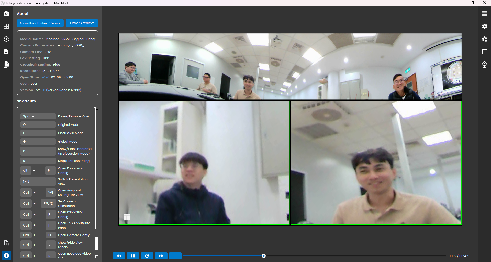

# Features

This version moves beyond simple viewing, offering a sophisticated suite of tools tailored for high-precision surveillance, dynamic presentations, and seamless operational control.

---

### What's New

#### Advanced Source & Parameter Management

Streamline your setup by choosing from multiple input types—including Open Camera, Load Media, Camera URL, or Token—while specifically configuring Camera Parameters (e.g., entaniya_vr220_1) to ensure optimal lens de-warping from the start.

*Advanced Source & Parameter Management*

#### Minimalist Dual-Panel Layout

A clean, modern interface featuring a Left Action Bar for rapid feature access and a Right Configuration Panel for precise camera management.

*Simple Clean UI Moil Meet*

#### Right-Click Context Menu

A context-aware right-click interface that adapts its options based on the viewing area selected, providing seamless control for both de-warped views and panoramic strips.

*Anypoint Right Click*

Specific right-click tools for individual viewports, allowing users to adjust perspective transformations, zoom, rotate Anypoint views, and flip image orientations independently.

*Panorama Click*

Specialized options when interacting with panoramic views, including quick access to Original Fisheye configurations, pausing views, and dedicated layout settings.

#### Comprehensive Shortcut Support

A robust keyboard-centric system designed to assist users with minimal mouse usage, significantly speeding up operational workflows.

*Shortcut Support*

#### Multilingual Interface

Multilingual Interface designed to bridge communication gaps and enhance accessibility for a diverse global user base. This feature allows users to operate the platform seamlessly in their native tongues, offering full support for Indonesian, Arabic, Malay, Japanese, Chineese, Traditional Chinese, Taiwanese Chinese. 

*Multilingual Interface*