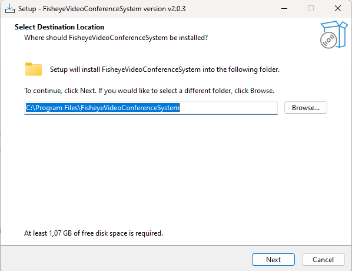
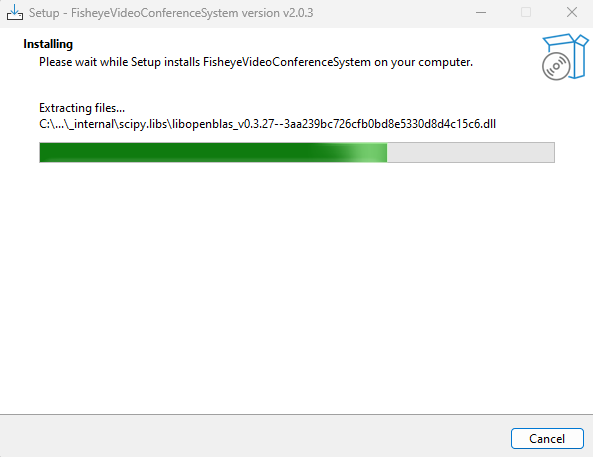
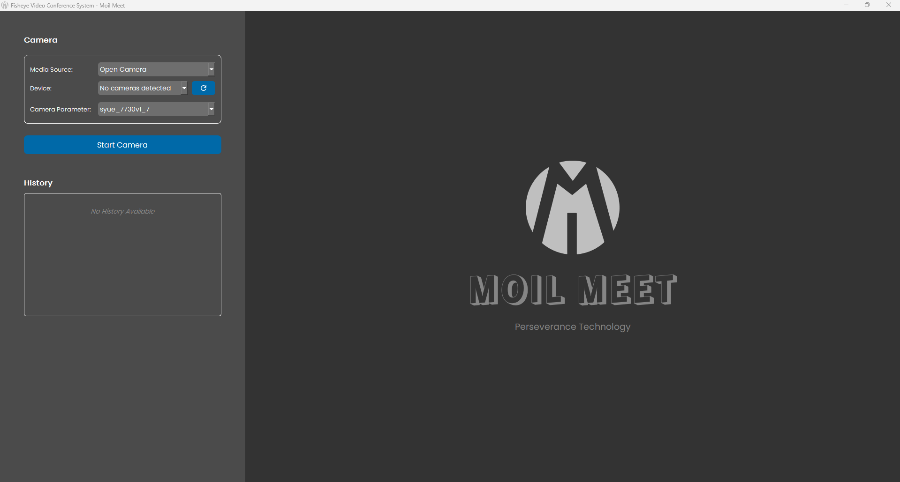

# Installation Guide

This guide provides step-by-step instructions to install and run the **Moil Meeting** application on your system.

---

## Operating System Requirements

### Windows

!!! note "Prerequisites for Windows"
    1. Download and install [OBS Studio](https://obsproject.com/download).
    2. Open OBS and click **Start Virtual Camera** before launching Moil Meeting.


*Start Virtual Camera in OBS Studio*

### Linux

!!! note "Prerequisites for Linux"
    1. Disable **Secure Boot** in BIOS settings.
    2. Install the `v4l2loopback` kernel module:

        ```bash
        sudo apt install v4l2loopback-dkms
        ```

---

## User Installation Guide

### Download Moil Meeting

1.  Visit the [Video Conference GitHub Repository (Releases)](https://github.com/perseverance-tech-tw/video-conference-app-release/releases/tag/v2.0.3).
2.  Download the appropriate installer:
    *   **Windows**: `FisheyeVideoConferenceSystemv2.0.3.exe`
    *   **Linux**: `FisheyeVideoConferenceSystem-v2.0.3-linux.7z`


*Repository Release Page*

### Windows Installation

**Step 1: Run Installer**
Right-click the installer file and select **Run as Administrator** to ensure proper permissions.



**Step 2: Follow Wizard**
Proceed through the installation wizard, selecting your preferred destination folder.


**Step 3: Access Application**
After installation, locate the application in your selected folder.
*   `FisheyeVideoConference.exe` — Launch the application.
*   `unins000` — Uninstall the application.


**Step 4: Launch**
You are now ready to use the Moil Meeting system.


*Moil Meeting Application Interface*

### Linux Installation

**Step 1: Extract Archive**
Unzip the downloaded `.7z` archive file.

**Step 2: Run Installation Script**
Navigate to the extracted folder and execute the install script:

```bash
./install.sh   # Install application
```

To remove the application later, use:
```bash
./uninstall.sh # Uninstall application
```

**Step 3: Launch**
Once installed, the application shortcut will appear on your desktop.


*Moil Meeting on Linux Desktop*

---

## Developer Installation Guide

This section is for developers who want to run Moil Meeting from source code.

### Prerequisites

| Component | Requirement |
| :--- | :--- |
| **OS** | Ubuntu or Windows |
| **Python** | Version 3.9 or higher |
| **Tools** | Git installed |

### Setup Steps

1.  **Clone Repository:**
    ```bash
    git clone https://github.com/username/video-conference-using-fisheye.git
    cd video-conference-using-fisheye
    ```

2.  **Set Up Virtual Environment:**

    *   **Windows:**
        ```bash
        python -m venv venv
        venv\Scripts\activate
        ```
    *   **Linux/macOS:**
        ```bash
        python3 -m venv venv
        source venv/bin/activate
        ```

3.  **Install Dependencies:**
    First, install core packages:
    ```bash
    pip install opencv-python pyvirtualcam ultralytics pygrabber mediapipe
    ```
    Then, install all requirements:
    ```bash
    pip install -r requirements.txt
    ```

4.  **Run Application:**
    Navigate to `src` and execute:
    ```bash
    python main.py
    ```

---

## Post-Installation

!!! note "Success"
    Installation is complete. Please proceed to the [Usage Guide](../usage/index.md) to learn how to operate Moil Meeting.

## Troubleshooting

| Issue Type | Solution |
| :--- | :--- |
| **Windows Camera** | Ensure OBS Virtual Camera is active *before* launching the app. Run as Administrator if issues persist. |
| **Linux Boot** | Verify that **Secure Boot** is disabled in your BIOS settings. |
| **Linux Modules** | Check if the loopback module is loaded: `lsmod | grep v4l2loopback`. |
| **Developer Env** | Ensure your virtual environment is activated and Python version is >= 3.9. |

---

*For additional support, refer to the [Operations Guide](../operations/index.md) or contact the Moil Meeting support team.*
