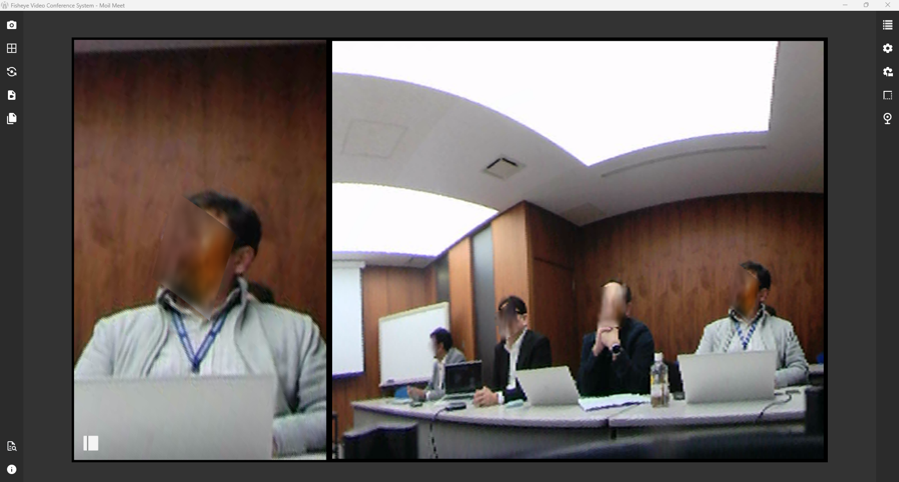

# Modes

Learn which mode fits each meeting or monitoring scenario. Each mode is optimized for a specific type of room activity.

## Operational Modes

### Original Mode
**Purpose:** Full-scope monitoring and situational awareness.

Displays the raw feed from the fisheye camera without de-warping. This mode is essential for seeing the complete, uncropped capture area, ensuring no detail is missed at the periphery.

Original Mode serves to display the entire image from the fisheye camera without any cropping or display changes. This mode allows users to see the entire area recorded by the camera, making it easier for surveillance and monitoring with a wide scope of view.​  

### Discussion Mode
**Purpose:** Interactive team collaboration.

Facilitates dynamic interaction by combining a panoramic overview with zoomed-in views of specific participants. The layout is customizable, allowing users to adjust the number and position of viewports to match the meeting size.

Users can customize Label Configuration, Panorama View, and the Vertical Threshold to optimize their workspace. The Label Configuration allows users to toggle labels or restore settings with Reset Label Default, while the Panorama View setting manages the visibility of the panoramic strip. For precise framing, the Vertical Threshold adjusts cropping height to keep participants' faces focused regardless of their seating. Together, these features foster clearer, more dynamic communication by providing multiple interactive viewpoints on a single screen.

### Global Mode
**Purpose:** International meetings and large-scale room coverage.

Designed for comprehensive visibility, this mode creates a split-screen layout showing a dual panoramic strip. It provides a flat, "unwrapped" view of the entire room, making remote participants feel as if they are seated at the center of the conference table.

### Patrol Mode
**Purpose:** Surveillance and automated presenting.

Automatically pans the view across the panoramic scene from right to left (or vice versa). This "scanning" behavior is ideal for monitoring large spaces or for presentations where the camera needs to dynamically shift focus across a stage.

### Presentation Mode
**Purpose:** Content focus and detail highlighting.

Allows the presenter to lock onto a specific "Anypoint" area. The software de-warps and zooms into this region, providing a clear, distortion-free view of a whiteboard, speaker, or screen, minimizing visual distractions from the rest of the room.

---

## AI Tracking
**Intelligent Participant Detection**

Available across all modes, AI Tracking uses sound localization and motion detection to automatically steer the virtual camera view.

-   **Sound & Motion:** Instantly detects who is speaking or moving.
-   **Auto-Focus:** Adjusts the viewport to center on the active subject.
-   **Toggleable:** Can be enabled/disabled instantly for manual control when needed.

!!! note "Optimizing Your Experience"
    Combine AI Tracking with the appropriate mode:

    - **Discussion Mode**: Automatically highlight speakers in a panel.
    - **Presentation Mode**: Follow a lecturer walking across a stage.
