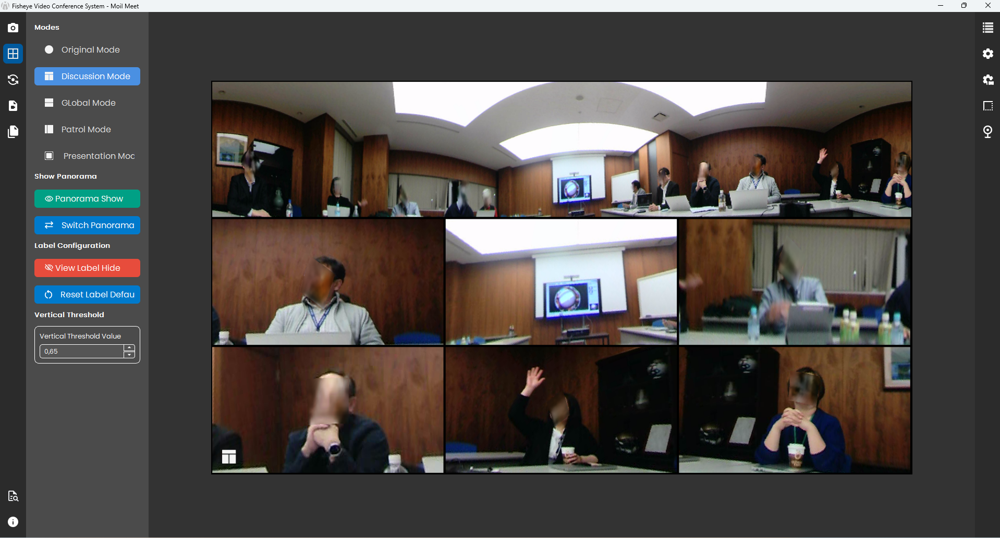
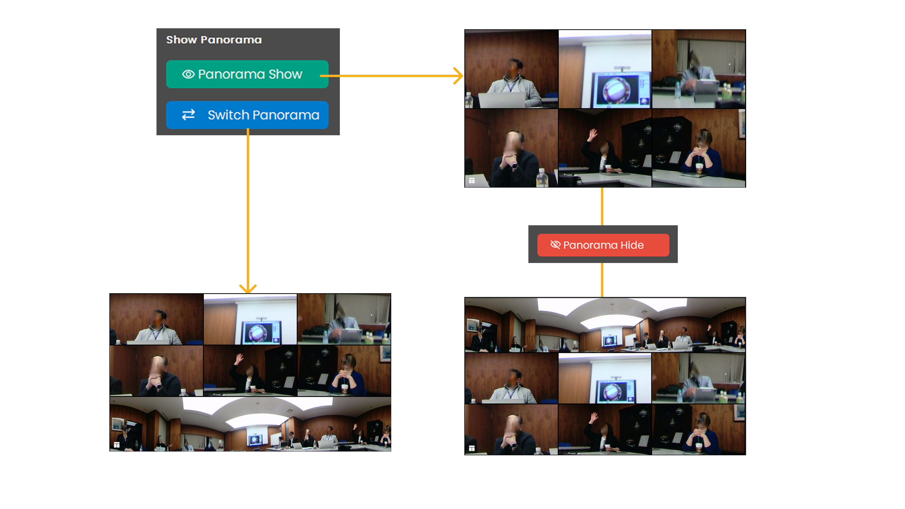
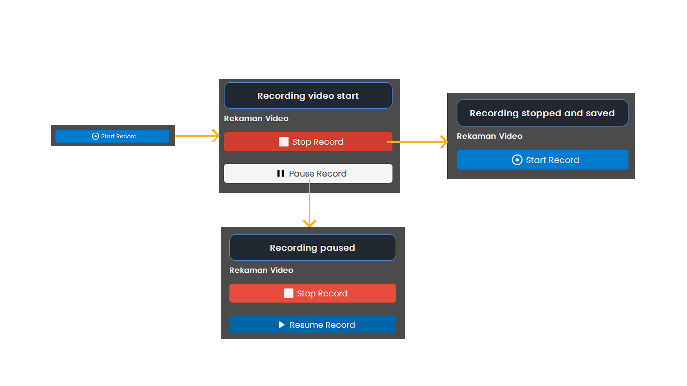
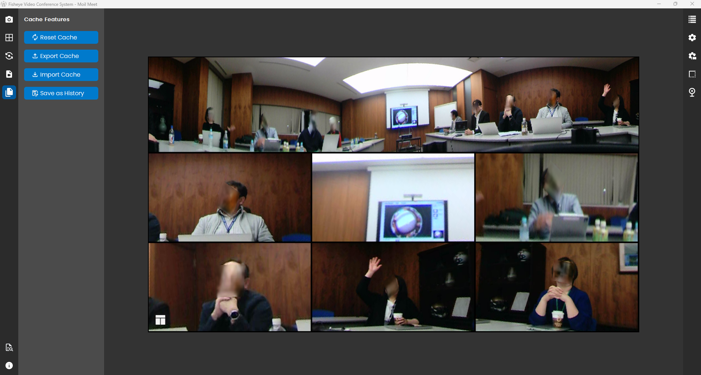
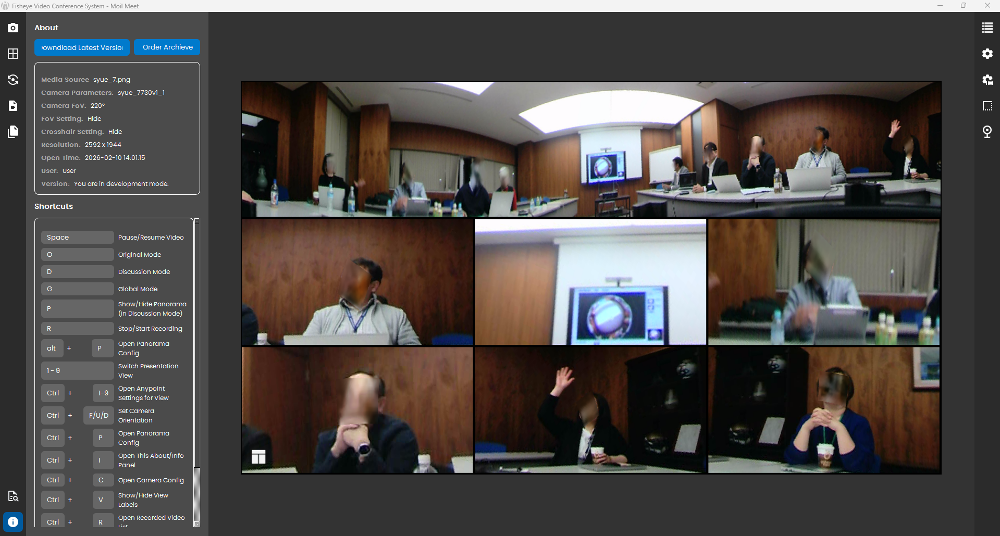
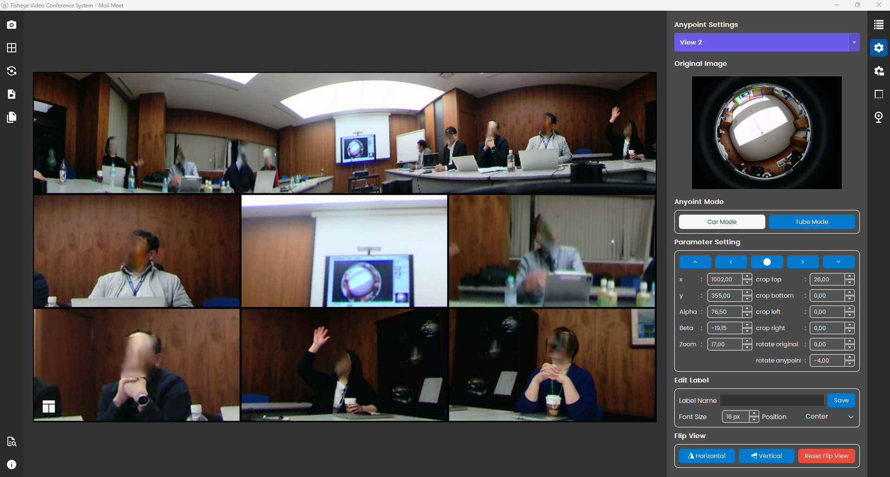
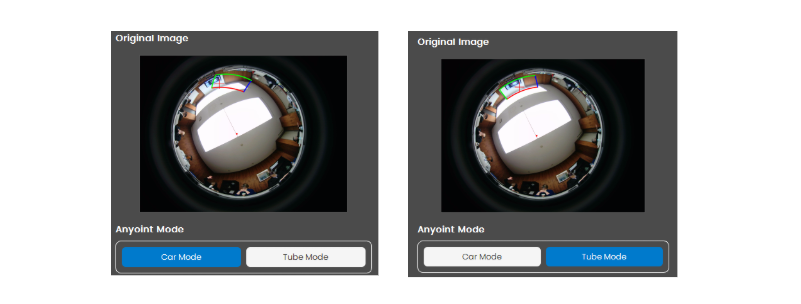
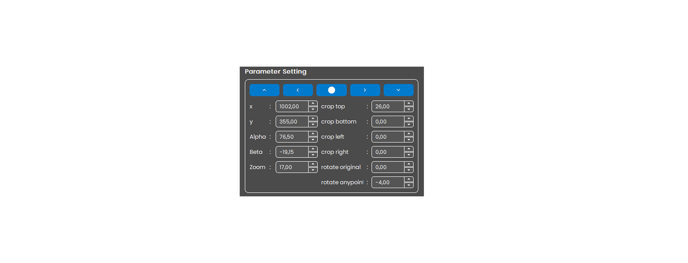
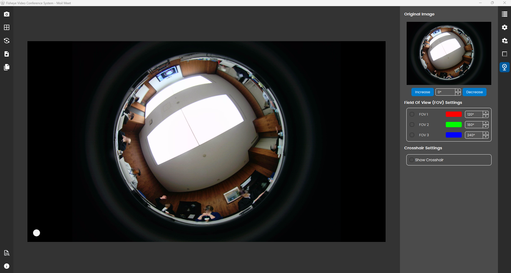
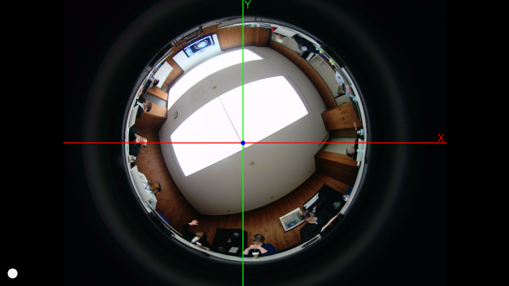

# Operations Guide

Use this guide to run Moil Meeting day to day. Start with the Quick Start Guide, then return here as a reference.

## Application Overview

**Fisheye Video Conference System** is a video conferencing application designed with a streamlined and modern interface. Upon launch, users are immediately presented with the main dashboard for rapid access to core functionalities.

### Operational Modes

The application features several distinct operational modes, accessible via the bottom navigation bar:

- **Start Camera** — Activates video capture for all modes.
- **Original Mode** — Displays the raw, uncorrected fisheye view.
- **Discussion Mode** — Facilitates interactive, multi-participant discussions.
- **Global Mode** — Connects participants globally with panoramic views.
- **Patrol Mode** — Automated surveillance scanning.
- **Presentation Mode** — Optimized for content delivery and focus.

*Main Interface with Mode Selection*

---

## Quick Start Guide

Welcome to **Moil Meeting**, a comprehensive solution for 360° video conferencing and surveillance. Whether hosting a remote meeting, monitoring a wide area, or delivering a presentation, this platform provides the flexibility you need.

### Initial Setup

Launch the application to access the main interface.

### Media Source Selection

Click the **START CAMERA** button to initiate the video feed. You will be prompted to select a source:

- **Open Camera** — Use a connected USB or built-in camera.
- **Load Media** — Play a pre-recorded video file.
- **Camera URL** — Connect to an IP camera stream.

*Original Mode Active*

Each source allows for detailed configuration, including resolution and frame rate adjustments.

### Switching Modes

Methods of operation can be switched dynamically. The application defaults to **Original Mode** upon initialization.

*Discussion Mode*

*Patrol Mode*

*Presentation Mode*

---

## Camera Operations

### Starting the Camera

*Source Selection Dialog*

**Procedure:**

1. Choose your input source in the dialog:
    
    - **Open Camera**: For physical devices.
    - **Load Media**: For file playback.
    - **Camera URL**: For network streams.

2. Click **Start Camera** to proceed.

### Camera Controls

*Playback Controls*

Once active, use the control bar to manage the feed:

- **Stop Camera**: Completely stops the video feed.
- **Pause Camera**: Freezes the current frame.
- **Play Camera**: Resumes the feed from a paused state.
- **Resolution**: Set the graphics quality to High for the best experience.
- **Language**: Set the application interface language.

---
## Detailed Mode Operations

### Original Mode

Displays the full **360-degree fisheye view**. This mode shows the complete, distorted image as captured by the sensor.

*360° Fisheye View*

**Key Benefits:**

- **Total Coverage:** Eliminates blind spots by capturing the entire room.
- **Situational Awareness:** Provides full context for surveillance or large meetings.
- **Simplicity:** No need for manual pan/tilt adjustments.

### Discussion Mode

Designed for multi-participant meetings, this mode creates virtual "cameras" from the single fisheye source.

*Discussion Mode Interface*

#### Configuration

Access settings via the **Config Button**:

Panorama View for to show or hide panorama view setting.  

Within Label Configuration, users have the option to show or hide labels or use the Reset Label Default feature to restore original settings.

### Global Mode

Displays a dual-panoramic strip, effectively "unwrapping" the 360° image into a flat view.

*Global Panoramic View*

**Features:**

- **Dual Views**: View two different panoramic angles simultaneously.
- **Flip Controls**: Orientation adjustment.

### Patrol Mode

Automates monitoring by panning the virtual view across the panoramic scene.

*Patrol Mode*

**Features:**

- **Instant Activation**: Begins scanning immediately upon selection.
- **Dynamic Control**: Use the slider to manually override or adjust the view.

### Presentation Mode

Focuses on a specific area of interest, such as a whiteboard or speaker, while minimizing distortion.

*Presentation Focus*

**Usage:**

1. Select **Presentation Mode**.
2. Use **Double Click**to show view presented
.
## Recorded Video

The Recorded Video feature in Moil Meet allows users to record live video sessions directly from the application. Once is started, a clear status indicator such as “Recording has started” and a REC timer appears on the screen to inform users that the recording is active.  

*Recorded Video*

### Start Recording

1. Click the **Start Recording** button.
2. A confirmation message, "Recording Video Start," will appear.

*Start Stop Record*

### Stop Recording

1. Click **Stop Recording**.
2. A "Recording Stop and Saved" confirmation will display the saved file path.

---

## Cache Menu

*Cache Menu*

**Features:**

- **Reset Cache**: Reset config for all view.
- **Export Cache**: Export config to device.
- **Import Cache**: Import config from device.
- **Save As History**: Save config along meeting.

---

## About Menu

*About Menu*

**Features:**

- **Information**: Displays technical details about the current video source.
- **Shortcut**: Support shortcut keyboard fully.

---

## View List

*View List *

**Features:**

- **Limit Person**: Choose between 2, 3, 4, 6, 8 or 9 participant views.
- **View List**: Manage individual views (Pause, Reorder, Configure).

---

## Anypoint Settings

*Anypoint Settings*

The Anypoint Settings panel provides advanced tools for manipulating and refining specific camera views from a fisheye source.

### Anypoint Mode

*Anypoint Settings*

On Anypoint Mode offers two primary projection methods there are Car Mode and Tube Mode. These modes determine how the fisheye image is mathematically remapped to create a natural-looking rectangular view.

### Parameter Settings

*Parameter Settings*

**Settings:**

1. **Coordinates (X, Y)**: Adjust the center point of the focus area
2. **Alpha Max, Alpha, Beta**: These three parameters form a group of settings used to control the viewing angle in the panorama.
3. **Left, Right, Top, Bottom**: These parameters are used to crop certain parts of the panorama.
3. **Rotate Original and Anypoint**: Rotates the original camera/frame view. Range rotation -180° to +180° Positive values for Rotate clockwise and Negative values for Rotate counterclockwise. The Rotate Anypoint feature allows users to adjust the orientation of the final video output with a range from -180° to +180°.

### Edit Label

*Edit Label*

**Procedure:**

1. **Input** new label
2. Config **Font Size** and **Position**
3. Click **Save**

### Flip View
 
Flip View provides quick-access buttons to flip the image Horizontal or Vertical, along with a Reset Flip View button to revert to the default orientation. 

---

## Panorama Settings

The Panorama Setting panel is designed to manage and refine the wide-angle panoramic view generated from the fisheye camera source. This configuration ensures that the primary wide-stream display is correctly aligned and cropped for optimal visibility.

### Parameter Setting Panorama

*Parameter Setting Panorama*

The Parameter Setting allows for granular adjustments to the panoramic projection:

**Settings:**

1. **Alpha Max & Alpha**: Controls the maximum vertical angle and current tilt of the panorama.
2. **Beta**: Adjusts the horizontal rotation or "panning" offset of the view.
3. **Crop Controls (Top, Bottom, Left, Right)**: Enables users to trim the edges of the panoramic strip to remove unwanted peripheral areas or lens distortions.

### Flip View Panorama

*Flip View Panorama*

Located at the bottom, Flip View provides quick-toggle buttons to mirror the panoramic stream:

**Options:**

1. **Horizontal**: Flips the image left-to-right.
2. **Vertical**: Flips the image top-to-bottom.
3. **Reset Flip View**: A red button to immediately revert all flip adjustments to the default state.

---

## Perspective Transformation Settings

*Perspective Transformation Settings*

This feature is designed to help you focus more easily on a specific object by allowing customized transformation adjustments as needed. When you activate the transform, the original appearance of the object (before any transformation) will appear in the corner as a reference, allowing you to compare the changes with the original version. If you wish to revert to the initial state, simply press the Reset button to discard all adjustments and restore the object to its original form. 

## Original Settings

*Original Settings*

### Field Of View (FOV) Setting

*Field Of View (FOV) Setting*

The Field of View (FOV) Setting in Moil Meet is a critical calibration tool that allows users to define and visualize the specific capture zones of the fisheye lens. Located within the camera configuration panel, this feature enables precise management of the optical coverage to ensure that all participants and meeting areas are properly accounted for in the processed views.

In Moil Meet, the Field of View (FOV) Settings provide a clear, color-coded overlay on the Original Image to help users understand exactly what the lens is seeing. The system supports three distinct FOV presets—**FOV 1 (Red)**, **FOV 2 (Green)**, and **FOV 3 (Blue)**—each of which can be customized to a specific degree, such as 120°, 180°, or 240°. By toggling these settings, users can see concentric dashed circles on the raw fisheye feed, which serve as a guide for framing and dewarping.

---

### Crosshair

*Crosshair View*

The Crosshair is a toggleable visual guide that, when activated by checking the "Show Crosshair" box, projects a prominent red horizontal axis (X) and a green vertical axis (Y) directly over the Original Image. At the exact intersection of these axes lies a blue focal point, which represents the mathematical center of the lens.

---

## Advanced Interactions

### Right-Click Context Menu

Available in all modes for rapid access to view-specific tools.

- **View Information**: Detailed stats for the specific view.
- **Save Image As**: Capture a snapshot.
- **Show Original Image**: Quickly toggle to the raw fisheye feed.
- **Pause View**: Freeze a specific quadrant.
- **Configuration View Setting**: Deep-dive into Anypoint transformation parameters.
- **Adjust Perspective Transformation**: Quick access to Perspective Transformation Settings
- **Zoom View**: Zoom view for Zoom In, Zoom Out and Reset Zoom
- **Rotate Original and Anypoint**: Rotate view for Rotate Left, Rotate Right and Reset Rotate
- **Flip View**: Flip view for Horizontal, Vertical and Reset Flip View

---

## Mouse Controls

### Drag to Move
Click and drag within a view to shift the visible region.

### Double-Click to Expand
Double-click any view to maximize it to full screen.

### Scroll to Zoom
Use the mouse wheel to zoom in and out.

!!! note "Tip"
    Use **Transformation** and **Adjusted Transform** features to precisely focus on specific objects while referencing the original image for context.

---

*For further assistance, please contact the Moil Meeting support team.*
