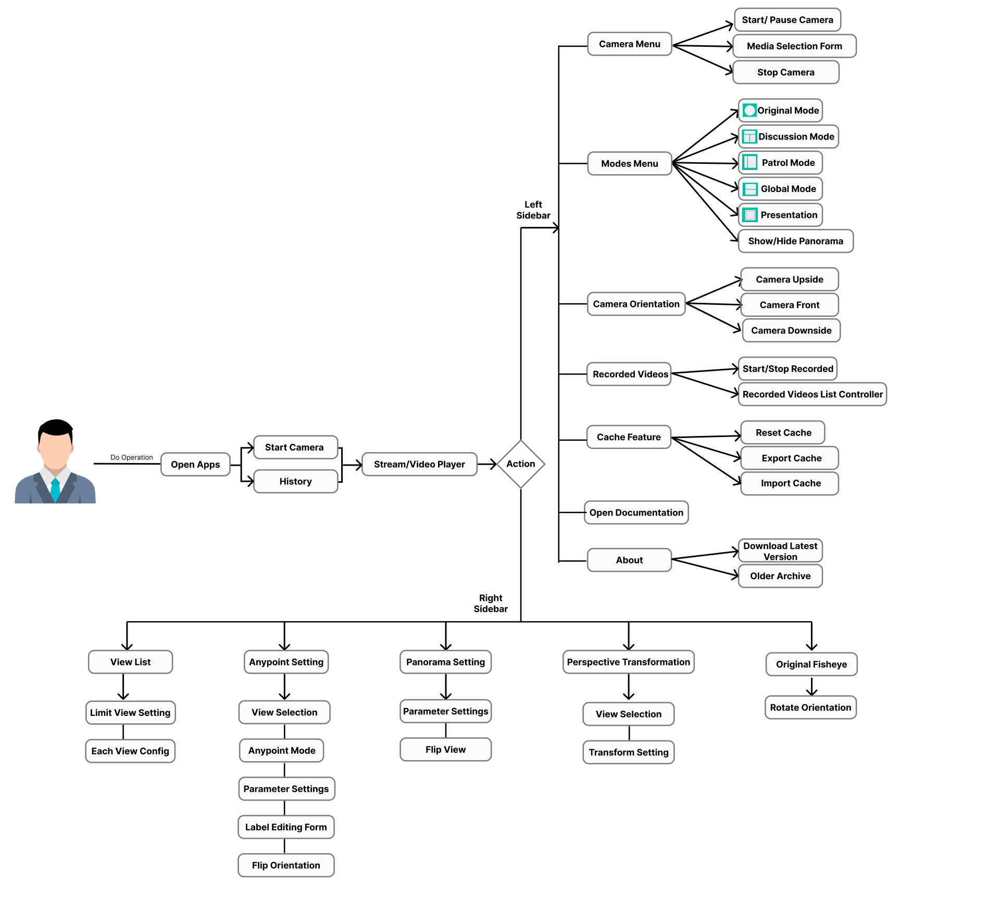

# Usage Guide

*Moil Meeting Application Interface*

This section provides comprehensive guidance on using the **Moil Meeting** application, explaining components, features, and operational procedures to help users maximize the platform's capabilities.

---

## Core Workflow

To get the most out of Moil Meeting, we recommend the following operational flow:

### 1. Initialize
*   **Start Camera:** Begin by selecting your video source (USB, IP, or File).
<!-- *   **Original Mode:** Verify your camera angle and lighting in the default view. -->

### 2. Configure
*   **Select Mode:** Choose the operational mode that fits your meeting type (e.g., *Discussion* for team meetings, *Presentation* for lectures).
*   **Adjust Views:** Use the **Right Bar** and right-click menus to config camera view, panorama view, and to arrange participant views.

### 3. Operate
*   **AI Tracking:** Enable for hands-free camera control.
*   **Recording:** Capture important sessions directly to your local drive.

---

## Operations Breakdown

For specific instructions, refer to the detailed sections below:

| Section | Content |
| :--- | :--- |
| **[Camera Controls](../operations/index.md#camera-operations)** | Starting, stopping, and selecting media sources. |
| **[Mode Selection](../modes/index.md)** | detailed breakdown of Original, Discussion, Global, Patrol, and Presentation modes. |
| **[Recording](../operations/index.md#recording-functions)** | How to start, stop, and manage video recordings. |
| **[Configuration](../operations/index.md#configuration-panel)** | Adjusting resolution, camera view, panorama view, anypoint and transformation, orientation, and UI settings. |

!!! note "Pro Tip"
    Right-click on any view to access quick actions like **Save Image** or **Pause View** without opening the main settings menu.
